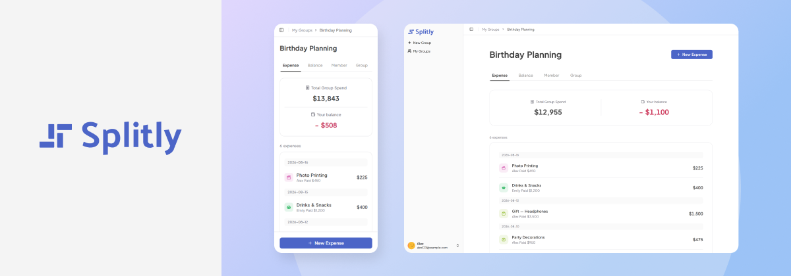

<h1 align="center">Splitly — Guest-Friendly Expense Splitter 🤩</h1>

<h4 align="center">A frictionless expense splitter and debt simplifier built with Next.js</h4>



<h3 align="center">✨ <a href="(https://splitly-site.vercel.app/ " target="_blank">Live Demo</a></h3>

<p align="center">Best viewed in Chrome</p>

<p align="center">
  
  
  
  
  
  
</p>

---

## ⚡ Try it in 10 seconds

Try the live demo instantly with demo ledgers. No sign-up required!

1. Open the 👉 **[Live Demo](https://splitly-site.vercel.app/)**
2. Sign in with a demo account

   | Account | Email                  | Password        |
   | ------- | ---------------------- | --------------- |
   | Alex    | `alex123@example.com`  | `User#Alex123`  |
   | Emily   | `emily456@example.com` | `User#Emily456` |

3. Explore pre-populated demo groups with realistic expense data.

---

## ✨ Core Highlights

### 1. Dynamic Split & Allocation Engine

- **Multi-Payer Allocation:** Supports single or multiple payers scenarios with customizable payment allocations.
- **Auto-Balancing Engine:** Auto-rebalances remaining expenses across unedited members on share changes.
- **Real-Time Balance Guard:** Ensures the total paid and total allocated amounts match the total expense.

### 2. Ledger Aggregation & Debt Simplification

- **Visual Balance Analytics:** Computes and charts each member's real-time net balance.
- **Greedy Settlement Optimizer:** Minimizes $N$-way group debt settlements into optimal transactions.

### 3. Progressive Onboarding & Identity Reconciliation

- **Zero-Friction Guest Access:** Supports friction-free guest onboarding via direct invitation links.
- **Atomic Identity Migration:** Migrates guest ledger states to authenticated accounts.

---

## 🧰 Tech Stack

| Layer               | Choice                                 | Rationale                                                                                                                                   |
| ------------------- | -------------------------------------- | ------------------------------------------------------------------------------------------------------------------------------------------- |
| **Framework**       | Next.js 16 (App Router), React 19      | Leverages React Server Components, automated compiler memoization, and Server Actions for seamless full-stack data mutations.               |
| **Database**        | Prisma 7 + PostgreSQL                  | Guarantees end-to-end type safety, simplifies relational queries, and provides lightweight serverless-ready database connectivity.          |
| **Auth**            | Better Auth (with Anonymous plugin)    | Ensures complete data ownership, Prisma serverless readiness, full-stack Next.js compatibility, and seamless guest-to-user account linking. |
| **Form Management** | React Hook Form + Zod                  | Eliminates redundant re-renders, minimizes boilerplate, and enables standardized, zero-cost schema validation across client and server.     |
| **State Strategy**  | Server-Driven (No client global store) | Eliminates client stores by leveraging URL parameters, built-in RSC caching, and seamless synchronization via Server Actions.               |
| **UI**              | Tailwind CSS v4 + shadcn/ui            | Delivers zero runtime overhead, production-ready components, and full code ownership.                                                       |

---

## 🤿 Technical Deep Dive

### 1. Zero-Sum Penny Remainder Allocation

- **Challenge:** Floating-point division (`$100 / 3 = $99.99`) breaks zero-sum balance.

- **Solution:** Stored every amount as integer cents. Locked manual rows, then floor-divided the remainder and gave one leftover cent to each of the first unlocked rows.

- **Impact:** Guaranteed (`Σ(shares) === total`) for every accepted expense.

### 2. O(1) Roundtrip Ledger Aggregation

- **Challenge:** Nested joins in a loop joins grow into an $O(N)$ query waterfall.

- **Solution:** Issued four parallel `groupBy` queries for payments, shares, and both settlement directions. Merged those sums in memory with a pure member-level reducer.

- **Impact:** Capped every group ledger read at four database round trips, at any member count.

### 3. Atomic Identity Reconciliation

- **Challenge:** A duplicate seat in the same group collides on guest link and strands ledger rows.

- **Solution:** Executed Better Auth `onLinkAccount` within a Prisma `$transaction`. Reassigned or merged the seat by summing payment and share cents, and retargeted settlements.

- **Impact:** Preserved one seat per user per group and kept cent totals unchanged.

---

## 🌳 Project Structure

> Built with **Next.js App Router**

```
src/
├── app/
│   ├── (auth)/          # /auth — email sign-in & sign-up
│   ├── (group)/         # Authenticated app shell (sidebar, header)
│   │   ├── @breadcrumb/ # Parallel route for contextual breadcrumbs
│   │   └── groups/      # Group CRUD, expenses, balance, members
│   ├── (public)/        # Landing page, /join/[inviteCode]
│   ├── actions/         # Server Actions (group, member, expense, auth)
│   └── api/auth/        # better-auth API handler
├── components/
│   ├── auth/            # Auth form steps
│   ├── balance/         # Balance chart, suggested transfers
│   ├── expense/         # Expense form, list, detail
│   ├── group/           # Group cards, form, spend summary
│   ├── members/         # Member list, invite link
│   └── ui/              # shadcn/ui primitives
├── lib/
│   ├── domain/          # Core business logic (allocation, ledger, settlement)
│   ├── queries/         # Server-only data access layer (React cache)
│   ├── validations/     # Zod schemas
│   ├── auth.ts          # better-auth server config
│   └── prisma.ts        # Prisma client singleton
├── providers/           # React context (members)
├── hooks/               # Client hooks (auth flow, mobile detection)
└── types/               # Shared TypeScript types
prisma/
├── schema.prisma        # Database schema
└── seed/                # Seed data (users, groups, expenses)
```

---

## 🚀 Getting Started

### Prerequisites

- Node.js 20+
- PostgreSQL
- pnpm

### Setup

```bash
# 1. Install dependencies
pnpm install

# 2. Configure environment
cp .env.example .env

# 3. Initialize database
pnpm prisma generate
pnpm prisma db push

# 4. Seed demo data
pnpm prisma db seed

# 5. Start development server
pnpm dev
```

### Environment variables

| Variable             | Description                                                |
| -------------------- | ---------------------------------------------------------- |
| `DATABASE_URL`       | PostgreSQL connection string with pooling (runtime)        |
| `DIRECT_URL`         | Direct PostgreSQL connection for migrations and Prisma CLI |
| `BETTER_AUTH_SECRET` | Session signing secret (`openssl rand -base64 32`)         |
| `BETTER_AUTH_URL`    | Auth server origin URL                                     |

---

## 🗺️ Roadmap

Core ledger, split engine, and guest-to-account merge are in place. Upcoming milestones focus on converting balance calculations into real repayments and expanding platform capabilities.

### Phase 1: Reconciliation & Reliability

- [ ] **Settlement Engine:** Convert suggested settlements into recorded repayments with partial payment support.
- [ ] **Advanced Split Logic:** Support percentage and weighted splits with rounding-error mitigation.
- [ ] **Comprehensive Test Suite:** Add property-based and integration tests for split invariants and ledger math.

### Phase 2: Analytics & Operations

- [ ] **Multi-Currency Support:** Support foreign currency entries with historical exchange rate snapshots.
- [ ] **Expense Analytics:** Add interactive charts for spending distribution across categories and members.
- [ ] **Ledger Query & Export:** Support multi-attribute filtering and CSV export.
